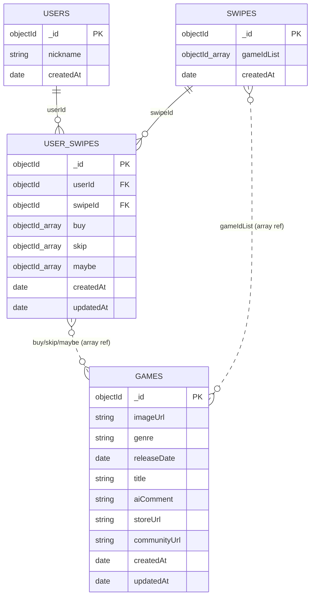

# MongoDB 컬렉션 설계

"게임을 살까 말까" 스와이프 서비스(willubuyitornot)의 MongoDB 컬렉션 구조 문서.
필드/타입/필수 여부는 `createCollection`의 `$jsonSchema` 검증 규칙을 정본으로 한다.

> ⚠️ Java 엔티티 동기화 필요 항목: 현재 `Game.java`는 구버전(`releaseYear: Integer`)으로,
> 본 문서의 `games` 스키마(`releaseDate: date` + `aiComment`/`storeUrl`/`communityUrl` 추가)와
> 차이가 있다. 엔티티 동기화는 별도 작업으로 처리한다.

## 개요

| 컬렉션 | 역할 |
|--------|------|
| `users` | 서비스 사용자(닉네임 기반) |
| `swipes` | 한 번의 스와이프 배치 단위(노출된 게임 묶음, reset 기준 시각) |
| `games` | 게임 카드 정보(이미지·장르·출시일·AI 코멘트·스토어/커뮤니티 링크) |
| `user_swipes` | 사용자별 스와이프 투표 기록(buy/skip/maybe) — `user_swipe` + `user_game` 통합 |

설계 의도: 노출 단위는 `swipes`(배치)로 관리하고, 사용자가 각 게임에 대해 내린 투표 결과는
`user_swipes`에 `(userId, swipeId)` 단위로 1건씩 누적한다. 게임에 대한 참조는 모두 `ObjectId`
배열로 보관한다.

## 컬렉션별 구성

### `users`

| 필드 | 타입(bsonType) | 필수 | 설명 |
|------|----------------|:----:|------|
| `_id` | objectId | ✓(자동) | User id |
| `nickname` | string | ✓ | 사용자 닉네임 |
| `createdAt` | date | ✓ | 생성 일시 |

`additionalProperties: false`

### `swipes`

| 필드 | 타입(bsonType) | 필수 | 설명 |
|------|----------------|:----:|------|
| `_id` | objectId | ✓(자동) | Swipe id |
| `gameIdList` | objectId[] (minItems 1) | ✓ | 이 스와이프 배치에 포함된 게임 ObjectId 목록 |
| `createdAt` | date | ✓ | 생성 일시(reset 기준 시각) |

`additionalProperties: false`

### `games`

| 필드 | 타입(bsonType) | 필수 | 설명 |
|------|----------------|:----:|------|
| `_id` | objectId | ✓(자동) | Game id |
| `imageUrl` | string | ✓ | 게임 썸네일 이미지 URL |
| `genre` | string | ✓ | 게임 장르 |
| `releaseDate` | date | ✓ | 출시일 (예: 2024-03-15) |
| `title` | string | ✓ | 게임 제목/설명 |
| `aiComment` | string | ✓ | 스와이프 카드에 노출되는 AI 한 줄 코멘트 |
| `storeUrl` | string | ✓ | 스토어 페이지 URL |
| `communityUrl` | string | ✓ | 커뮤니티 페이지 URL |
| `createdAt` | date | ✓ | 문서 생성 일시 |
| `updatedAt` | date | | 문서 최종 수정 일시 |

`additionalProperties: false`

### `user_swipes`

| 필드 | 타입(bsonType) | 필수 | 설명 |
|------|----------------|:----:|------|
| `_id` | objectId | ✓(자동) | User swipe record id |
| `userId` | objectId | ✓ | `users._id` 참조 |
| `swipeId` | objectId | ✓ | `swipes._id` 참조 |
| `buy` | objectId[] | ✓ | 'buy'로 투표한 게임 ObjectId 목록 |
| `skip` | objectId[] | ✓ | 'skip'으로 투표한 게임 ObjectId 목록 |
| `maybe` | objectId[] | ✓ | 'maybe'로 투표한 게임 ObjectId 목록 |
| `createdAt` | date | ✓ | 생성 일시 |
| `updatedAt` | date | | 최종 수정 일시 |

`additionalProperties: false`

## 인덱스 (`user_swipes`)

| 인덱스 키 | 옵션 | 용도 |
|-----------|------|------|
| `{ userId: 1, swipeId: 1 }` | `unique` | 사용자×스와이프 배치당 기록 1건 보장 |
| `{ swipeId: 1 }` | - | 스와이프 배치 기준 조회 |
| `{ userId: 1 }` | - | 사용자 기준 조회 |

## 전체 컬렉션 구조

ObjectId 배열을 통한 참조는 정식 FK가 아니라 애플리케이션 레벨의 "array reference"이다(아래 점선/주석 표기).



## 원본 쿼리 (참고용)

아래는 설계 정본으로 사용한 MongoDB 셸 쿼리 원본이다.

```js
// 1. users Collection
db.createCollection("users", {
  validator: {
    $jsonSchema: {
      bsonType: "object",
      required: ["nickname", "createdAt"],
      properties: {
        _id: {
          bsonType: "objectId",
          description: "User id (ObjectId)"
        },
        nickname: {
          bsonType: "string",
          description: "User nickname"
        },
        createdAt: {
          bsonType: "date",
          description: "User created datetime"
        }
      },
      additionalProperties: false
    }
  }
});

// 2. swipes Collection
db.createCollection("swipes", {
  validator: {
    $jsonSchema: {
      bsonType: "object",
      required: ["gameIdList", "createdAt"],
      properties: {
        _id: {
          bsonType: "objectId",
          description: "Swipe id (ObjectId)"
        },
        gameIdList: {
          bsonType: "array",
          description: "List of game ObjectIds included in this swipe batch",
          items: {
            bsonType: "objectId"
          },
          minItems: 1
        },
        createdAt: {
          bsonType: "date",
          description: "Swipe created datetime (reset 기준 시각)"
        }
      },
      additionalProperties: false
    }
  }
});

// 3. games Collection (aiComment/storeUrl/communityUrl 추가, releaseYear->releaseDate)
db.createCollection("games", {
  validator: {
    $jsonSchema: {
      bsonType: "object",
      required: [
        "imageUrl",
        "genre",
        "releaseDate",
        "title",
        "aiComment",
        "storeUrl",
        "communityUrl",
        "createdAt"
      ],
      properties: {
        _id: {
          bsonType: "objectId",
          description: "Game id (ObjectId)"
        },
        imageUrl: {
          bsonType: "string",
          description: "Game thumbnail image URL"
        },
        genre: {
          bsonType: "string",
          description: "Game genre"
        },
        releaseDate: {
          bsonType: "date",
          description: "Release date (e.g. 2024-03-15)"
        },
        title: {
          bsonType: "string",
          description: "Game title or description"
        },
        aiComment: {
          bsonType: "string",
          description: "AI one-line comment shown on swipe card"
        },
        storeUrl: {
          bsonType: "string",
          description: "Store page URL"
        },
        communityUrl: {
          bsonType: "string",
          description: "Community page URL"
        },
        createdAt: {
          bsonType: "date",
          description: "Game document created datetime"
        },
        updatedAt: {
          bsonType: "date",
          description: "Game document last updated datetime"
        }
      },
      additionalProperties: false
    }
  }
});

// 4. user_swipes Collection (user_swipe + user_game 통합)
db.createCollection("user_swipes", {
  validator: {
    $jsonSchema: {
      bsonType: "object",
      required: ["userId", "swipeId", "buy", "skip", "maybe", "createdAt"],
      properties: {
        _id: {
          bsonType: "objectId",
          description: "User swipe record id (ObjectId)"
        },
        userId: {
          bsonType: "objectId",
          description: "Reference to users._id"
        },
        swipeId: {
          bsonType: "objectId",
          description: "Reference to swipes._id"
        },
        buy: {
          bsonType: "array",
          description: "List of game ObjectIds voted as 'buy'",
          items: {
            bsonType: "objectId"
          }
        },
        skip: {
          bsonType: "array",
          description: "List of game ObjectIds voted as 'skip'",
          items: {
            bsonType: "objectId"
          }
        },
        maybe: {
          bsonType: "array",
          description: "List of game ObjectIds voted as 'maybe'",
          items: {
            bsonType: "objectId"
          }
        },
        createdAt: {
          bsonType: "date",
          description: "Swipe record created datetime"
        },
        updatedAt: {
          bsonType: "date",
          description: "Swipe record last updated datetime"
        }
      },
      additionalProperties: false
    }
  }
});

// 인덱스 생성
db.user_swipes.createIndex({ userId: 1, swipeId: 1 }, { unique: true });
db.user_swipes.createIndex({ swipeId: 1 });
db.user_swipes.createIndex({ userId: 1 });
```
